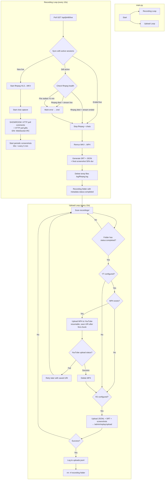

# Liverecorder

Auto-record live stream video + chat + gift from SHOWROOM and IDN Live, with automatic upload to YouTube and replay data storage to R2.

## Prerequisites

| Tool | Minimum |
|------|---------|
| Python | 3.10+ |
| ffmpeg | 4.4+ (`ffmpeg -version`) |
| Backend | `make dev-be` running on `localhost:8000` |

## System Flow



## Directory Structure

```
recorder/
├── __init__.py
├── main.py                       # Entry point
├── auth_youtube.py               # YouTube OAuth flow (get refresh token)
├── requirements.txt
├── .env                          # Local config (gitignored)
├── .env.example                  # Config template
├── recordings/                   # Output (configurable via REC_RECORDINGS_DIR)
│   ├── {nickname}_{unix_ts}/     # Per-recording folder
│   │   ├── {live_id}.mkv         # Temporary (deleted after remux)
│   │   ├── {live_id}.mp4         # Final video (deleted after YT upload)
│   │   ├── {live_id}.log         # Raw chat TSV (deleted after remux)
│   │   ├── {live_id}.jsonl       # Structured chat/gift NDJSON
│   │   ├── {live_id}.srt         # Chat transcript
│   │   ├── {live_id}.json        # Metadata
│   │   ├── {live_id}.ffmpeg.log  # ffmpeg stderr (deleted after remux)
│   │   ├── {live_id}.upload_uri  # YT resume URI (deleted after upload)
│   │   ├── {live_id}_yt_thumb.jpg# Auto-generated 16:9 collage thumbnail
│   │   └── screenshots/
│   │       ├── {nickname}_{ts}.jpg
│   │       └── ...
│   └── .gitkeep
├── logs/                         # Logs & upload history
│   ├── recorder.log
│   ├── uploader.log
│   └── uploads.jsonl
└── src/
    ├── __init__.py
    ├── config.py                 # Pydantic settings (REC_* env vars)
    ├── logging_config.py         # Dual logger setup (recorder + uploader)
    ├── models.py                 # LiveInfo, RecordingSession dataclasses
    ├── record/
    │   ├── __init__.py
    │   ├── live_detector.py      # Polls /api/jkt48/live
    │   ├── stream_recorder.py    # ffmpeg subprocess management
    │   ├── chat_capture.py       # SHOWROOM (HTTP) + IDN (WS) chat/gift
    │   ├── srt_generator.py      # .log TSV -> .srt conversion
    │   └── manager.py            # Recording lifecycle orchestration
    └── upload/
        ├── __init__.py
        ├── watcher.py            # Background upload pipeline
        ├── youtube_uploader.py   # Resumable YT upload via API
        └── r2_uploader.py        # Replay data -> backend -> R2
```

## Quick Start

```bash
# 1. From repo root
source .venv/bin/activate

# 2. Install dependencies (one-time)
pip install -r recorder/requirements.txt

# 3. Run
python -m recorder.main
```

### CLI Arguments

You can pass several arguments to `recorder/main.py` for advanced control:

| Argument | Description | Example |
|----------|-------------|---------|
| `--mode {both,record,upload}` | Run only specific loop (default: `both`). Useful for systemd services. | `python -m recorder.main --mode record` |
| `--status [folder]` | Check status of all recordings or a specific folder. | `python -m recorder.main --status` |
| `--remux [folder]` | Force remux interrupted/stuck `.mkv` files to `.mp4`. | `python -m recorder.main --remux all` |
| `--delete [folder]` | Delete all recording folders or a specific one. | `python -m recorder.main --delete oline_1782911092` |
| `-y, --yes` | Bypass confirmation prompts for destructive commands. | `python -m recorder.main --delete all -y` |

Output is in `recorder/recordings/`:

```
recorder/recordings/
├── oline_1782911092/
│   ├── ayo-ngobrol-bareng-260701223500.mp4
│   ├── ayo-ngobrol-bareng-260701223500.srt
│   ├── ayo-ngobrol-bareng-260701223500.json
│   ├── ayo-ngobrol-bareng-260701223500.jsonl
│   ├── ayo-ngobrol-bareng-260701223500_yt_thumb.jpg
│   └── screenshots/
│       ├── oline_1782911092.jpg
│       └── ...
└── ...
```

> **Note**: Recording uses `.mkv` (Matroska) so the file appears immediately and grows in real-time.
> When the session ends, it is automatically remuxed to `.mp4` (H.264 + AAC, `-movflags +faststart`).

## How It Works

1. Poll `GET /api/jkt48/live` every 10 seconds
2. New live detected → start ffmpeg + chat capture (comments + gifts)
3. Live ends → stop, remux `.mkv` → `.mp4`, generate `.srt` + `.json` + screenshots
4. Output: `.mp4` (video) + `.srt` (chat) + `.json` (metadata) + `.jsonl` (raw chat data) + `screenshots/` + `_yt_thumb.jpg` (collage)
5. **Upload pipeline**: Watcher picks up completed recordings → generate `_yt_thumb.jpg` → upload to YouTube (if configured) → upload replay data (JSONL + SRT + Thumbnails) to backend API for R2 storage → cleanup folder

## Output Files

| File / Dir | Description |
|------------|-------------|
| `*.mp4` | Final video (HLS → Matroska → MP4, `-c copy`, no re-encode) |
| `*.mkv` | Temporary recording file (deleted after remux) |
| `*.log` | Raw chat log (intermediate, deleted after remux) |
| `*.jsonl` | Structured chat/gift data (NDJSON, uploaded to backend then kept) |
| `*.srt` | Chat transcript synced to video |
| `*.json` | Metadata (member, timestamps, title, youtube_id, etc.) |
| `*_yt_thumb.jpg` | Auto-generated 16:9 collage thumbnail for YouTube and R2 |
| `screenshots/` | Periodic `.jpg` captures every 5 min + final capture at 50% duration |

After successful upload to YouTube and backend, the entire folder is removed.

## Metadata JSON Format

```json
{
  "live_id": "ayo-ngobrol-bareng-260701223500",
  "status": "completed",
  "platform": "idn",
  "room_id": null,
  "room_identifier": "rbwoihikwwldms",
  "title": "Ayo ngobrol bareng!",
  "member_name": "Oline Manuel",
  "member_nickname": "Oline",
  "start_at": "2026-07-01T15:35:15Z",
  "recording_started_at": "2026-07-01T16:38:13Z",
  "recording_ended_at": "2026-07-01T16:41:25Z",
  "duration_seconds": 192,
  "srt_file": "ayo-ngobrol-bareng-260701223500.srt",
  "youtube_id": "VQw4w9WgXcK",
  "youtube_title": "LIVE IDN Oline JKT48 | 1 Juli 2026 22:35 WIB"
}
```

## SRT Format

```
1
00:00:03,500 --> 00:00:03,500
user_a: hello everyone

2
00:00:12,100 --> 00:00:12,100
[GIFT] user_b: sending gift
```

This format is 100% compatible with the `ReplayChat.svelte` parser on the frontend.

## Configuration (via .env)

| Variable | Default | Description |
|----------|---------|-------------|
| `REC_API_BASE_URL` | `http://localhost:8000/api` | Backend API URL |
| `REC_POLL_INTERVAL` | `10` | Live poll interval in seconds |
| `REC_RECORDINGS_DIR` | `recorder/recordings` | Output directory |
| `REC_MAX_RECORDING_HOURS` | `4` | Max recording duration |
| `REC_SHOWROOM_COMMENT_INTERVAL` | `2.0` | SHOWROOM comment poll interval |
| `REC_SHOWROOM_GIFT_INTERVAL` | `5.0` | SHOWROOM gift poll interval |
| `REC_LOG_LEVEL` | `INFO` | Logging level |
| `REC_LOG_MODE` | `stdout` | Log output: `stdout` or `file` |
| `REC_LOGS_DIR` | `recorder/logs` | Log storage directory |
| `REC_REPLAY_API_URL` | `/admin/replay/upload` | Backend endpoint for replay upload |
| `REC_REPLAY_API_KEY` | `""` | API key for replay upload |
| `REC_GOOGLE_CLIENT_ID` | `""` | Google OAuth client ID (YouTube upload) |
| `REC_GOOGLE_CLIENT_SECRET` | `""` | Google OAuth client secret |
| `REC_YOUTUBE_REFRESH_TOKEN` | `""` | YouTube refresh token |
| `REC_YOUTUBE_PRIVACY_STATUS` | `unlisted` | YouTube video privacy (`public`, `unlisted`, `private`) |

## Platform Support

| Platform | Stream Source | Chat Method |
|----------|--------------|-------------|
| SHOWROOM | HLS via `/api/jkt48/live/showroom/{id}/streaming-url` (uses `room_id`, picks highest quality) | HTTP poll `comment_log` + `gift_log` API every 2s / 5s |
| IDN Live | HLS via `/api/jkt48/live/idn/{slug}/streaming-url` (uses `live_id`) | WebSocket IRC `wss://chat.idn.app/` |

## Upload Pipeline

After a recording ends (`status: "completed"` in metadata), a background **Watcher** processes it:

1. **YouTube upload** (if `REC_GOOGLE_*` + `REC_YOUTUBE_REFRESH_TOKEN` configured) — resumable upload with progress tracking; `.mp4` is deleted after success
2. **Replay upload** (if `REC_REPLAY_API_KEY` configured) — sends `.jsonl` (raw chat data), `.srt`, and screenshots to the backend API, which stores them in R2
3. **Cleanup** — on success, the entire recording folder is removed; upload history is tracked in `logs/uploads.jsonl` to prevent re-upload

## FAQ

**Q: No video output?**
A: Make sure the backend is running (`make dev-be`) and a member is live.

**Q: ffmpeg error?**
A: Run `ffmpeg -version` to verify installation. Minimum version 4.4.

**Q: Only chat recorded, video is empty?**
A: Check the HLS URL from the `streaming-url` endpoint. The platform may be having issues.

**Q: Want to change output directory?**
A: Set `REC_RECORDINGS_DIR` in `.env` or as an environment variable.

**Q: How to enable YouTube upload?**
A: Follow the [YouTube Upload Setup](#youtube-upload-setup) steps below.

**Q: Why are some videos uploaded as YouTube Shorts?**
A: Due to a recent YouTube update, all vertical videos (like IDN Live) under 3 minutes are automatically classified as Shorts. Horizontal videos (like Showroom) remain regular videos regardless of length.

**Q: How to skip specific members?**
A: (Not yet implemented — currently records all active streams.)

## YouTube Upload Setup

### 1. Create OAuth Client ID

1. Go to [Google Cloud Console](https://console.cloud.google.com/)
2. Create a new project or select an existing one
3. Enable **YouTube Data API v3** (APIs & Services → Library)
4. Go to **Credentials**, click **Create Credentials** → **OAuth client ID**
5. Application type: **Desktop app**
6. Add `http://localhost` to **Authorized redirect URIs**
7. Copy the **Client ID** and **Client Secret**

### 2. Set environment variables

```bash
# In recorder/.env
REC_GOOGLE_CLIENT_ID=xxxxx.apps.googleusercontent.com
REC_GOOGLE_CLIENT_SECRET=GOCSPX-xxxxx
```

### 3. Generate refresh token

```bash
python -m recorder.auth_youtube
```

This opens a browser window asking you to log in to Google and authorize access.
After authorizing, the script prints the refresh token. Add it to `.env`:

```bash
REC_YOUTUBE_REFRESH_TOKEN=1//0xxxxx
REC_YOUTUBE_PRIVACY_STATUS=unlisted
```

The script (`recorder/auth_youtube.py`) handles the OAuth desktop flow locally
and requests the `youtube.upload` scope.

### 4. Publish OAuth consent screen (required for permanent token)

By default, your OAuth consent screen is in **Testing** mode — refresh tokens
expire after **7 days**. To get a permanent token:

1. Go to **APIs & Services → OAuth consent screen** in Google Cloud Console
2. Click **Publish App** under *Publishing status*
3. Scope `youtube.upload` is sensitive — Google may require verification.
   Workaround if the app is for personal use: remove any logo from the consent
   screen and fill in the required fields (support email, privacy policy link
   can be a placeholder). The status may change to *Verification not required*
   if only non-sensitive scopes remain, allowing you to publish without review.

> **Without publishing, you must re-run `auth_youtube.py` every 7 days** to
> get a fresh token.
